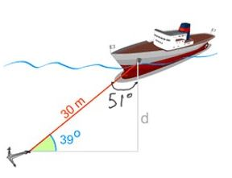

# Instructions  

  In this lab you will calculate the distance to the sea bed by calculating the angle opposite to &#952; 

  ## Steps
  
  1. Ask the sea captain for the length of their anchor cable and angle that they observe by their boat (ex 51 degrees)​

  1.  calculate the depth to the seabed using the appropriate trig functions in the math module​

1. display the depth with 2 decimal places​

Help here for formula:  https://www.mathsisfun.com/sine-cosine-tangent.html 

Don't forget test data 